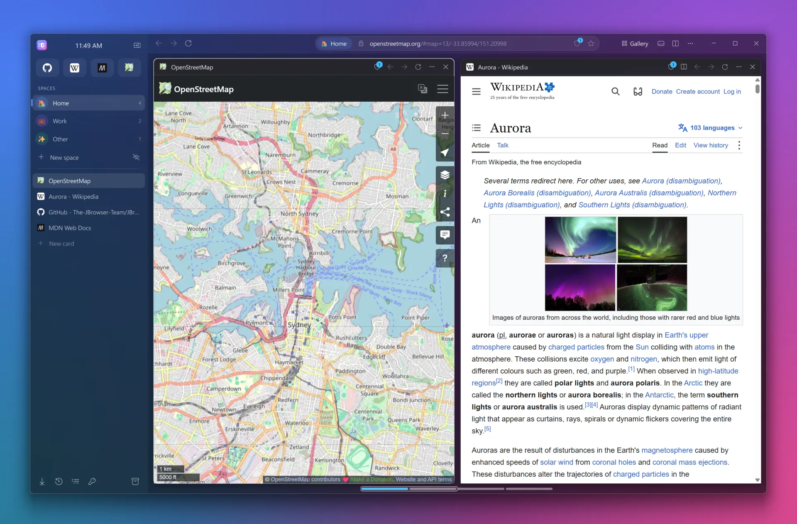

<p align="center">
  
</p>

<h1 align="center">JBrowser</h1>

<p align="center">
  <em>Welcome to the internet - again.</em><br>
  A spatial, privacy-focused web browser for Windows 11.
</p>

<p align="center">
  <a href="https://the-jbrowser-team.github.io/JBrowser/"><b>Website</b></a> ·
  <a href="https://the-jbrowser-team.github.io/JBrowser/download/"><b>Download</b></a> ·
  <a href="https://the-jbrowser-team.github.io/JBrowser/changelog/"><b>Changelog</b></a> ·
  <a href="https://the-jbrowser-team.github.io/JBrowser/docs/"><b>Developer docs</b></a>
</p>

<p align="center">
  <a href="https://github.com/The-JBrowser-Team/JBrowser/releases/latest"></a>
  <a href="LICENSE"></a>
  
  
</p>

JBrowser replaces the tab strip with an **infinite horizontal canvas of web cards** and organises them into
**isolated Spaces**, driven from a vertical sidebar and a keyboard-first **Lazy Toolbar**. It runs in a
native-feeling Windows 11 window with an Acrylic or Mica backdrop, and it is built with Python and
PyQt6 / Qt WebEngine (Chromium).

<p align="center">
  
</p>

Made with ❤️ by the JBrowser Company. © 2026 The JBrowser Company.

## Highlights

- **Spatial canvas.** Cards sit side by side and can be resized, split and reordered. Keep scrolling past either end
  to pull in a new card.
- **Spaces.** *Home*, *Work*, *Other*, or your own spaces. Each has its own cookies and storage, and you can open
  incognito spaces too. Favourites and pinned cards sit above them.
- **Gallery.** See every card of a space, or of all spaces, at a glance; filter, open, close and move them.
- **Lazy Toolbar** (Ctrl+T / Ctrl+K). One box for addresses, searches, open cards, bookmarks, history, passwords and
  100+ commands.
- **Private by default.** Ad and tracker blocking (EasyList and EasyPrivacy), phishing and malware protection,
  fingerprinting protection, secure DNS (Quad9), HTTPS-first and link cleaning.
- **Built in.** An encrypted password manager, downloads, history, the Archive of recently closed cards, DevTools,
  user scripts and per-space proxies.
- **Light on memory.** Out-of-sight cards stop rendering, and idle cards hibernate.
- **Updates itself.** New versions arrive from GitHub Releases and are verified before they install.

See **[docs/FEATURES.md](docs/FEATURES.md)** for the full list and the keyboard shortcuts.

## Release notes

### 1.5.0 (latest) · 29 September 2026 · [download](https://github.com/The-JBrowser-Team/JBrowser/releases/tag/v1.5.0)

- **Gallery** (Ctrl+Shift+G, or the new *Gallery* button): every card of a space as a grid of live thumbnails. Filter,
  open, close and reorder cards, and switch to **All spaces** to see every space at once and drag cards between them.
- **Colour tints**: 10 colours and *No colour* in Settings → Appearance and the welcome setup. A light wash over
  Acrylic or Mica, stronger with *Solid*; incognito spaces stay black.
- **Drag cards anywhere**: by the card's ribbon (or Alt + drag on the page) along the canvas or onto a space in the
  sidebar, and within the sidebar list.
- **Ad and tracker blocking that works**: a real Adblock Plus filter engine for EasyList and EasyPrivacy, and ad
  boxes are hidden before the page paints.
- **Fewer CAPTCHAs** on Google and Cloudflare: JBrowser now looks like the Chrome it is built on, and leaves
  sign-in and security-check sites untouched.
- The clock is centred in the sidebar, and the *New card* button shows even in an empty space.

### Earlier versions

| Version | Highlights |
|---|---|
| 1.4.1 | Setup closes a running JBrowser for you, a 30 MB smaller download, nothing lost when Windows closes JBrowser |
| 1.4.0 | Automatic updates from GitHub, a proper Windows installer, a livelier welcome animation, open source under the GNU GPL v3 |
| 1.2.0 | First-run welcome and guided tour, pull to add a card, favourites and pinned cards, the Archive (closed cards from the last 48 hours), an optional Home button |
| 1.1.0 | Rebuilt Settings, phishing and malware protection, fingerprinting protection, HTTPS-first, download protection, *Clear browsing data* and *Reset* |
| 1.0.0 | First release: the spatial card canvas, isolated Spaces, the Lazy Toolbar, memory saver, secure DNS, tracker blocking and the password manager |

Every change is listed in **[CHANGELOG.md](CHANGELOG.md)**, and each release's notes are on the
[Releases page](https://github.com/The-JBrowser-Team/JBrowser/releases).

## Install the latest version

### One command (recommended)

Open **PowerShell** and paste:

```powershell
irm https://raw.githubusercontent.com/The-JBrowser-Team/JBrowser/main/install.ps1 | iex
```

This downloads the latest release zip, checks its SHA-256 fingerprint, and starts the installer. Run the same command
again at any time to update. [install.ps1](install.ps1) is short, so you can read it first.

### Download the zip yourself

1. Open the **[latest release](https://github.com/The-JBrowser-Team/JBrowser/releases/latest)** and download
   **`JBrowser-<version>-<date>.zip`**, for example `JBrowser-1.4.0-2026-09-28.zip`.
2. Extract it, then run **`JBrowser-Setup-<version>.exe`**. `INSTALL.txt` in the zip explains each step.
3. The installer works for your Windows account without administrator rights. It adds a Start menu entry, and it can
   register JBrowser as a web browser so you can make it your default in Windows Settings.

The release page also has the installer on its own (`JBrowser-Setup-<version>.exe`). Windows SmartScreen may warn about
an unrecognised app, because the installer is not code-signed; choose *More info → Run anyway*. To uninstall, use
*Settings → Apps → Installed apps → JBrowser*. Your data is kept unless you choose to delete it.

### Updates

An installed JBrowser checks GitHub once a day. When a new version is out, an **Update** button appears on the ribbon.
Click it to read what's new, then choose *Install and restart*. You can also use *Settings → About → Check now*, or
turn automatic checks off there. [docs/AUTO_UPDATE.md](docs/AUTO_UPDATE.md) explains how updating works.

## Run from source

You need Windows 10 or 11 and [Python 3.14+](https://www.python.org/downloads/) (64-bit).

```powershell
git clone https://github.com/The-JBrowser-Team/JBrowser.git
cd JBrowser
py -3.14 tools\update_deps.py        # creates .venv, installs everything and checks every import
.\.venv\Scripts\python.exe main.py
```

Run `tools\update_deps.py` again at any time to update all packages. [docs/DEVELOPMENT.md](docs/DEVELOPMENT.md)
covers the command-line options, test profiles, debugging and code conventions, and the
**[developer documentation](https://the-jbrowser-team.github.io/JBrowser/docs/)** explains the architecture, the web
engine, privacy, the UI and the release process for every version, with a generated Python API reference.

## Build and release

You need Python 3.14+, [Inno Setup 6](https://jrsoftware.org/isinfo.php) (`winget install JRSoftware.InnoSetup`)
and, to publish, [GitHub CLI](https://cli.github.com/) signed in with `gh auth login`.
**[master.ps1](master.ps1)** does everything else, from the repository folder:

| Goal | Command |
|---|---|
| Build and package the current version | `.\master.ps1` |
| Release a new version (update) | `.\master.ps1 -Version 1.4.1 -Publish` |
| Rebuild the current version and refresh its release files | `.\master.ps1 -Publish` |

It updates every package and checks every import, builds the app and the installer, and packages them as
**`distribution\JBrowser-<version>-<date>.zip`**. With `-Publish`, it also commits and pushes your changes and publishes
the GitHub release. Installed copies then update themselves, and the one-command install above picks it up. Before
releasing a new version, describe it in [CHANGELOG.md](CHANGELOG.md) and under *Release notes* above.

The steps can also be run on their own (`tools\build_app.ps1`, `tools\build_installer.ps1`, `tools\release.ps1`).
When the repository is inside OneDrive, the build folder is `%LOCALAPPDATA%\JBrowser-build` so OneDrive doesn't sync
it. Guides: [docs/BUILDING.md](docs/BUILDING.md) and [docs/RELEASING.md](docs/RELEASING.md).

## Repository layout

| Path | What's inside |
|---|---|
| [`jbrowser/`](jbrowser/README.md) | The application package: start-up, dependency wiring and file locations |
| [`jbrowser/core/`](jbrowser/core/README.md) | Building blocks with no UI: settings, commands, motion, fuzzy search, URL handling |
| [`jbrowser/models/`](jbrowser/models/README.md) | The browser state: spaces, cards and the per-frame update pipeline |
| [`jbrowser/services/`](jbrowser/services/README.md) | Features without widgets: history, passwords, privacy, network, updates and more |
| [`jbrowser/engine/`](jbrowser/engine/README.md) | Qt WebEngine integration: per-space profiles, pages, lifecycle, injected scripts |
| [`jbrowser/platform/`](jbrowser/platform/README.md) | Windows-specific code: backdrops, window frame, DPAPI |
| [`jbrowser/ui/`](jbrowser/ui/README.md) | Every widget: window, canvas, cards, sidebar, Lazy Toolbar, welcome |
| [`jbrowser/ui/dialogs/`](jbrowser/ui/dialogs/README.md) | Settings and the tool windows (history, passwords, downloads, and more) |
| [`assets/`](assets/README.md) | Icon, logo and sound effects bundled with the app |
| [`installer/`](installer/README.md) | The Inno Setup script for `JBrowser-Setup.exe` |
| [`tools/`](tools/README.md) | Scripts for dependencies, versions, icons, builds and releases |
| [`docs/`](docs/README.md) | Features, architecture, development, building, releasing and updates |
| [`site/`](site/README.md) | The website: home page, download page, changelog and the versioned developer docs |
| [`.github/`](.github/GITHUB_CONFIG.md) | Continuous integration, issue and pull-request templates |
| `master.ps1` | Builds, packages and publishes everything in one command |
| `install.ps1` | Installs or updates JBrowser from the latest release zip (the one-command install) |
| `distribution/` | Zips made by `master.ps1` (local only, not in git) |
| `main.py`, `JBrowser.spec` | Entry point and the PyInstaller recipe |
| `requirements*.txt` | Runtime and build dependencies |

## Contributing and security

Contributions are welcome: see [CONTRIBUTING.md](CONTRIBUTING.md) and the [code of conduct](CODE_OF_CONDUCT.md). Please report vulnerabilities privately, as
described in [SECURITY.md](SECURITY.md).

## Licence

JBrowser is free software under the **[GNU General Public License v3.0](LICENSE)**. You may use, study, share and
modify it, and anything you distribute that is based on it must stay under the same licence.

It builds on these projects, each under its own licence:
- [PyQt6 and PyQt6-WebEngine](https://www.riverbankcomputing.com/software/pyqt/) (GPL v3)
- [Qt 6 and Qt WebEngine](https://www.qt.io/), which includes [Chromium](https://www.chromium.org/) (LGPL v3 and
  Chromium's BSD-style licences)
- [cryptography](https://cryptography.io/) (Apache 2.0 or BSD)
- [requests](https://requests.readthedocs.io/) (Apache 2.0)
- [pywinstyles](https://github.com/Akascape/py-window-styles) (CC0)

The sound effects are credited in [assets/sounds/CREDITS.txt](assets/sounds/CREDITS.txt).
